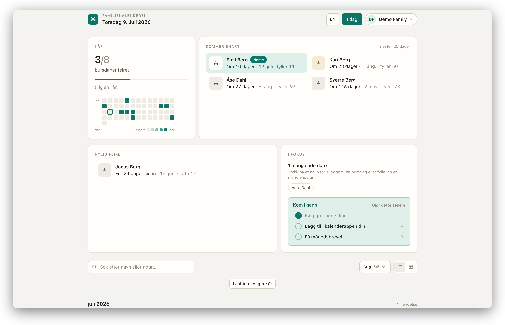

# Family Calendar

A private calendar for birthdays and other important dates across the family.

<picture>
  <source media="(prefers-color-scheme: dark)" srcset="docs/calendar-dark.png">
  
</picture>

## Why?

With 50+ close-ish family members spanning 3–4 generations, keeping an overview
becomes genuinely hard. Birthdays live in someone's head, a paper list, or a
group chat scroll-back — and every year someone is surprised by a milestone
birthday or forgets which cousin's kid just turned five.

This app is that overview. In various shapes — a calendar dashboard, iCal
subscription feeds, a monthly email newsletter, and person pages — it answers
questions like:

- **Whose birthday is coming up — and what did we just celebrate?** The
  dashboard always shows what's next, alongside a recently-celebrated list
  and a birthdays-this-year counter.
- **When was that birthday again?** Round birthdays
  are called out so nobody misses a 50th or a 90th, and search plus group and
  event-type filters find any date without scrolling twelve months.
- **When was grandpa born, and when did he pass away?** Deceased relatives
  keep their dates, with "would have turned" wording and a yearly remembrance.
- **What's happening in *my* branch of the family?** Every member follows the
  family groups relevant to them and sees a calendar scoped to those.
- **Can I get this in the calendar I already use?** Every member gets a
  personal iCal feed for Google, Apple, or Outlook Calendar.
- **Do I actually know these dates by now?** A low-stakes recall quiz —
  questions drawn from the family's real birthdays — helps them stick.
- **Who is this person, again?** Notes with `@mentions` and `[[wiki-links]]`
  connect people, so context doesn't stay locked in one relative's memory.

The app is a **Fresh 2 / Vite** app on Deno, backed by Deno KV. Fresh serves the
web pages, admin pages, JSON API, and per-viewer iCal subscription feeds.

## Files

| File / directory | Purpose |
| --- | --- |
| `routes/` | Fresh file routes for pages, JSON API, health check, and iCal feeds. |
| `lib/` | Domain logic: store, KV adapter, seed loading, iCal, holidays, validation. |
| `seed/*.csv` | Optional CSV data loaded by the explicit seed command. |
| `test/` | Deno tests for domain logic and Fresh route handlers. |
| `main.ts` | Fresh `App` entry point. |
| `vite.config.ts` | Fresh 2 Vite plugin config. |
| `docs/architecture.md` | Architecture notes. |
| `docs/design.md` | Visual/product design notes. |
| `docs/self-hosting.md` | Running it for real: service, HTTPS origin, email, backups. |

## Configuration

Configuration comes from environment variables. Copy the template and edit as
needed — every `deno task` loads `.env` automatically (via Deno's `--env-file`):

```sh
cp .env.template .env
```

`.env` is gitignored; keep real secrets out of the repo. `ENVIRONMENT` is
required; everything else is optional (without the email keys, mail logs to the
console instead of sending). See `.env.template` for the full annotated list;
the ones you'll most likely set:

| Variable | Purpose |
| --- | --- |
| `ENVIRONMENT` | `DEV` or `PROD`. Picks the database (`.data/dev.sqlite3` vs `.data/kv.sqlite3`) and the cookie policy (DEV allows non-Secure cookies for http). |
| `BASE_URL` | Public origin for emailed links and iCal feed URLs. |
| `KV_PATH` | Maintenance-only override of the DB path (e.g. booting a backup copy). |
| `RESEND_API_KEY`, `RESEND_FROM` | Send real email via Resend (PROD only — DEV always logs to the console). |
| `OLLAMA_HOST`, `INTRO_MODEL`, `OLLAMA_KEEP_ALIVE` | Local newsletter-prose model (built-in defaults work as-is). |
| `INTRO_DISABLED`, `INTRO_CMD` | Turn prose off, or shell out to a different local model command. |

Values already present in the real environment take precedence over `.env`, so
deploys can inject secrets without a file. See `docs/self-hosting.md` for a
production/self-hosting guide.

## Running

```sh
deno task dev
```

The dev server always runs on the local dev database `.data/dev.sqlite3` and
refuses to start if it doesn't exist. Two ways to create one:

1. `deno task subset` — copy the production database (`.data/kv.sqlite3`).
2. `ENVIRONMENT=DEV deno task seed` — a fresh database from `seed/*.csv`; then
   issue an admin link and enter your own groups and people.

The seed command refuses to modify a non-empty database. Use `--force` to clear
people, viewers, and invites and replace groups before loading:

```sh
ENVIRONMENT=DEV deno task seed --force
```

## Try it with demo data

A fictional two-branch family ships in `seed/demo/` so you can explore the app
without any real data:

```sh
cp .env.template .env                      # set ENVIRONMENT=DEV
ENVIRONMENT=DEV deno task seed seed/demo
deno task dev
```

Then open <http://localhost:3000/view/demo-admin> — you're signed in as the
demo admin, so the calendar, profile, and every `/admin/` page are live. The
data covers the interesting cases: a milestone birthday, an unknown birth
year, a remembered relative, and notes with `@mention` and `[[wiki-link]]`
references. `demo-viewer` is a second, non-admin token following only one
branch.

## Access links

`issue-link` targets the **dev** database by default (issuing links is usually a
testing action) and prints `http://localhost:3000` URLs; pass `--prod` to write
to production and use `BASE_URL`. Other CLI tasks follow `ENVIRONMENT` from
`.env` (PROD in this working tree) unless overridden inline. Issue a
cryptographically random capability:

```sh
deno task issue-link \
  --name "Solveig" \
  --email solveig@example.com \
  --groups no \
  --prod
```

The command prints private calendar and iCal URLs. `--email` is required — it is the
viewer's magic-link login identity. Use `--groups no,dk` for the groups the viewer
follows; omitting `--groups` means they follow nothing until they pick groups on
their profile. Add `--admin` to make the viewer an administrator and print an admin
URL. On an empty database, create the first admin without `--groups`, then add
groups at `/admin/groups/`.

There is no username/password form. Opening a private capability URL stores the
token in an HttpOnly cookie and redirects to the clean `/calendar/` URL. The
session lasts for up to one year; **Log out** clears both calendar and admin
sessions. Share capability URLs privately and replace a viewer token if it leaks.
Issuing a new link with the same viewer name expires that viewer's previous active
link.

## Family invites

Editors can create reusable, expiring signup links at `/admin/invites/`. Choose a
30-minute, 4-hour, 1-day, or 7-day expiry, optionally cap how many people may join
(a signup limit), decide whether signups receive administrator access
(**view-only by default** — only grant admin deliberately), and share the
generated URL privately. The invite stops working once it expires or its signup
limit is reached. Until then, each person who opens it:

1. Enters their name.
2. Selects the family groups that apply to them.
3. Receives a new private viewer link and is signed in automatically.

Everyone who joins through an invite can add and edit people and events. Invites
only grant administrator access when an admin explicitly checks that option while
creating them. Each person receives an independent capability, while the invite
itself can be reused by multiple family members until its expiry.

## Administration

Open the admin URL printed by `issue-link --admin`. It validates the admin token,
stores it in an HttpOnly session cookie, and redirects to `/admin/`.

- `/admin/people/` edits people in a batch table and exports `people.csv`.
- `/admin/groups/` edits family groups.
- `/admin/viewers/` lists issued capabilities and their permissions.
- `/admin/invites/` creates and lists expiring family signup links.
- `/admin/audit/` shows changes attributed to the member who made them.

Any member can add people and events, and edit person details, directly from the
calendar flyout. Changes are written to KV and audited under the member's name.

Death dates use full `YYYY-MM-DD` values. Deceased relatives keep their birthday with
“would have turned” wording and also receive a yearly remembrance event on the anniversary of
their death.

## Permissions

Every active viewer can add and edit people and events. The stored property is
`Viewer.isAdmin`, which defaults to `false`: admins can additionally manage
viewers and invites, delete events, send the newsletter, and read the audit log.
Family invites only grant admin access when explicitly selected at creation.

Create an admin at issuance time (in the dev database unless `--prod`):

```sh
deno task issue-link \
  --name "Family admin" \
  --admin \
  --prod
```

Grant or remove admin access for an existing viewer by updating that property:

```sh
deno task set-permission \
  --token "the-viewer-token" \
  --admin true

deno task set-permission \
  --token "the-viewer-token" \
  --admin false
```

An admin can use the admin pages and the bulk-replace people API. Every viewer can
open their scoped calendar and iCal feed and add or edit people and events.

## Subscribing

In Google, Apple, or Outlook Calendar, choose "Subscribe from URL" and paste the
iCal URL printed by `issue-link`.

## Testing / build

```sh
deno task check
deno fmt --check
deno lint
deno task build
```

Generated Fresh output lives in `_fresh/` (scratch builds) and `_prod/` (what
production serves; written only by `deno task deploy`) — both git-ignored.
