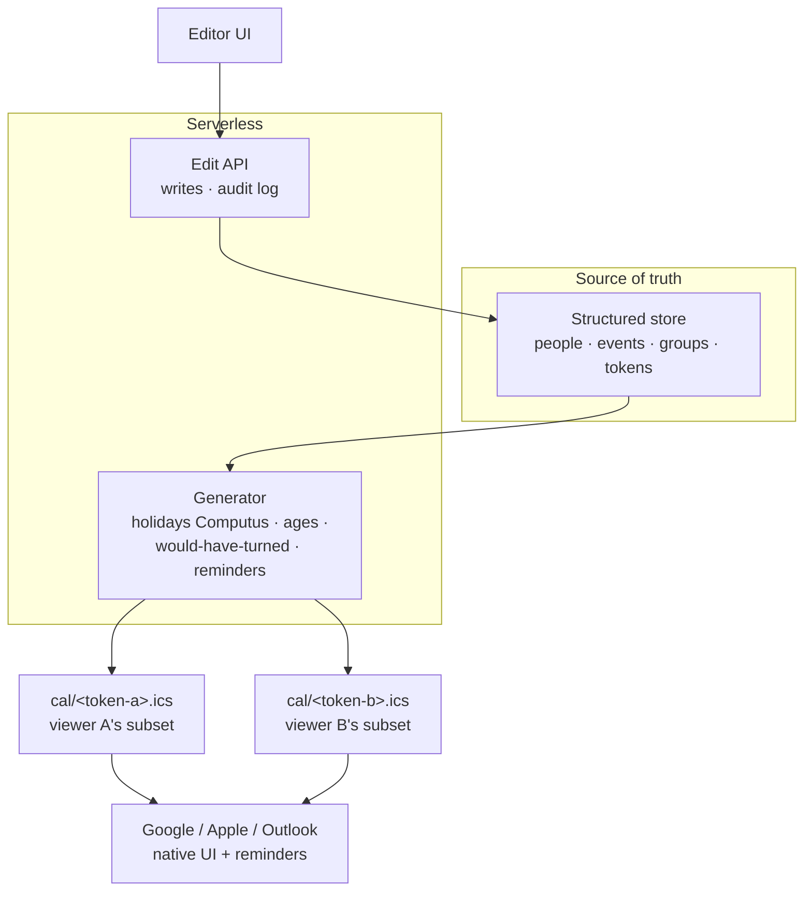

# Architecture

> **Status:** Implemented baseline. The repo now runs as a Fresh 2 / Vite app:
> structured store (Deno KV) → Fresh routes/generator/API → per-viewer iCal
> feeds, web app, and admin. New KV stores are empty; CSV files in `seed/` are
> loaded only by the explicit `deno task seed` command.

## Decision

The locked architecture is:

**Structured store → serverless generator → per-viewer iCal feeds.**

Calendar apps (Google, Apple, Outlook) are **subscribers**, not the source of
truth. Each person subscribes to a personal feed URL that returns exactly the
events relevant to them, with reminders applied to their taste.

## Principles

1. **One structured source of truth.** Facts (people, events, relationships)
   live in a structured store, never in a calendar app or a prose document.
2. **Calendars are render targets.** We emit standard iCal; Google/Apple/Outlook
   just display it. We never depend on a calendar app's data model.
3. **Access is a capability.** A feed URL carries a per-person token. Sharing =
   handing out a token; revoking = rotating that one token.
4. **Vendor-neutral.** The design depends only on (a) a structured store, (b) a
   function that emits iCal, (c) a small edit API. Any of D1 / Turso / Postgres /
   SQLite satisfies (a); any serverless runtime satisfies (b)/(c).
5. **Computed, not hand-maintained.** Holidays, ages, "would have turned", and
   milestone flair are derived at generation time, not stored.
6. **Language-agnostic, but TypeScript → Deno preferred.** No part of the design
   requires a specific language. If we go TypeScript (likely, given it's a
   web/iCal/text-emitting workload), the preferred runtime is **Deno / Deno
   Deploy**: native TS with no build step, web-standard `Request`/`Response` for
   the feed and edit endpoints, and an optional built-in store (Deno KV) if we
   want to stay in one ecosystem. This is a preference, not a lock-in — the seams
   below keep other runtimes viable.

## Overview



## Components

### 1. Structured store

Holds the canonical data. See the data model below. The store is reached through
a thin data-access interface so the concrete engine (D1/Turso/Postgres/SQLite)
can be swapped without touching the generator or API.

### 2. Generator (serverless function)

Turns stored facts into a per-viewer iCal document on request:

- **Holidays are computed, not stored.** Every NO/DK public holiday is either
  fixed-date or Easter-relative; Easter is deterministic (Computus). A small pure
  function produces correct holidays for any year — no external API, no yearly
  maintenance, no stale table. Holiday sets (NO, DK) are opt-in per viewer.
- **Derived fields** are applied here: current age, milestone flair, and the
  deceased rephrasing (`turned 94` → `would have turned 94`).
- **Recurring vs one-time** events are both emitted, but only recurring ones get
  an `RRULE:FREQ=YEARLY`. One-time future events (e.g. an upcoming confirmation)
  appear once.
- **Reminders** (`VALARM`) are applied per the viewer's saved preference and the
  per-kind default policy (birthdays on, others off by default). All-day-safe
  triggers (land at ~9am, never midnight). Note: Apple/Outlook honor embedded
  alarms; Google applies its own per-calendar default.

### 3. Per-viewer iCal feeds

- URL shape: `…/cal/<token>.ics`. The token both **authorizes** access and
  **identifies** the viewer (to pick their subset + reminder prefs).
- **Subsetting** uses the viewer's selected groups/tags (see data model). This is
  what solves "irrelevant people/dates": each feed contains only what that person
  opted into.
- Subscribers add the URL once ("Subscribe from URL"). Updates propagate on the
  app's refresh schedule.
- **Refresh caveat:** Google polls external feeds slowly (often 12–24h+, not
  controllable). Irrelevant for birthdays (known far ahead); acceptable for this
  domain. We do **not** push into Google-owned calendars via their API, because
  that re-couples us to Google and forces N calendars for relevance.

### 4. Edit API + identity + audit

- Writes go through a small authenticated endpoint (replacing today's
  download-and-commit flow).
- **Identity** is captured for attribution ("who changed what"). With a real
  endpoint, the audit log is a first-class table, not git history.
- Editor tokens are distinct from / higher-privilege than read (feed) tokens.

## Data model (sketch, not final)

```
Person {
  id
  name
  born:  "YYYY-MM-DD" | "MM-DD" | null   // partial/unknown allowed
  died:  "YYYY-MM-DD" | null             // drives "would have turned" + remembrance
  groups: ["no", "solveig-side", ...]       // many-to-many tags (NOT access control)
  notes: string                          // free text for informal color
}

Event {
  id
  kind:      "birthday" | "wedding" | "death" | "baptism" | "confirmation" | ...
  date:      "YYYY-MM-DD" | "MM-DD" | null
  subjects:  [personId, ...]             // 1 for birthday, 2 for wedding, ...
  recurring: bool                        // default derived from kind
  // reminders are NOT stored per-event; see reminder policy
}

Viewer {
  token                                   // capability: access + identity
  name                                    // for attribution
  groups: ["no", "danish", "holidays-no"] // which tags this feed includes
  canEdit: bool                           // may load editor/write/audit endpoints
  reminderPref: "off" | "morning" | "day-before" | "week+day"
}
```

Notes:

- `birthday` events can be **derived** from `Person.born` rather than stored
  separately; explicit `Event`s are for things like weddings/baptisms.
- `groups` on a person are **soft visibility tags**, deliberately *not* an access
  control list. Everyone with a valid token can technically be given any subset;
  relevance is a per-viewer preference, not a permission. This avoids the
  "who's in/out of the family" governance trap.

## Access / security model

- **Access** = possession of a valid feed token (capability URL, ideally an
  unguessable random token). Rotatable per person → real per-person revocation.
- **Identity** = derived from the token (or a one-time "who are you?" prompt for
  the editor). Used for personalization and audit, never as a security boundary
  on its own.
- **Audit** = an append-only log written by the edit API, keyed by identity.
- Honest threat model: this protects against *casual/public discovery and
  indexing*, and supports *per-person revocation*. A trusted family member with a
  token can still read everything in their subset — acceptable for this data.
- Graduation path if true SSO/login is ever wanted: Cloudflare Access or Netlify
  Identity (magic-link, no password), without building auth ourselves.

## Vendor neutrality — the abstract contract

Everything else is an implementation detail behind these three seams:

| Seam            | Contract                                                   | Candidate impls                                  |
| --------------- | ---------------------------------------------------------- | ------------------------------------------------ |
| Store           | CRUD over Person/Event/Viewer + audit append               | Deno KV, D1, Turso, Postgres, SQLite, libSQL     |
| Feed generator  | `(token) → text/calendar` (iCal)                           | **Deno Deploy** (preferred), CF Workers, Netlify |
| Edit API        | authenticated writes + audit                               | same runtime as generator                        |

Preferred default stack: **TypeScript on Deno Deploy**, with the store behind a
thin interface. D1 / Deno KV are both fine starting points but **no code should
depend on a specific store's specifics** — keep store access behind that
interface so the engine stays swappable.

## Migration path from the current prototype

Completed:

1. Deno server serves the web app and JSON API.
2. Deno KV is the runtime source of truth, with optional explicit seeding from
   `seed/*.csv`.
3. Per-viewer iCal feeds exist at `/cal/<token>.ics` and subset by viewer groups.
4. Holidays are computed with Computus instead of stored.
5. Edit API writes to KV and records audit entries.
6. Capability issuance is available through `deno task issue-link`; editors use
   `/admin/*` and can manage people and groups.

Next:

1. Add token rotation and revocation tooling.
2. Enrich the model (`Event.kind`, recurring flag).

## Deferred / out of scope (YAGNI for now)

- Connection/relationship **graph view** (novelty for a calendar; revisit only if
  this becomes a family wiki).
- **Per-event/per-person reminder overrides** (per-kind default + per-viewer lead
  time covers real needs).
- **Hard per-person access control** beyond token possession (relevance stays a
  soft preference).
- Markdown-per-person / wiki-link data model and **Reflect-as-store** (rejected:
  single-admin bottleneck + lock-in).

## Open questions

- Token issuance/rotation UX (how a new relative gets onboarded).
- Whether one-time life events also warrant a separate **timeline** view, or just
  live on a person profile.
